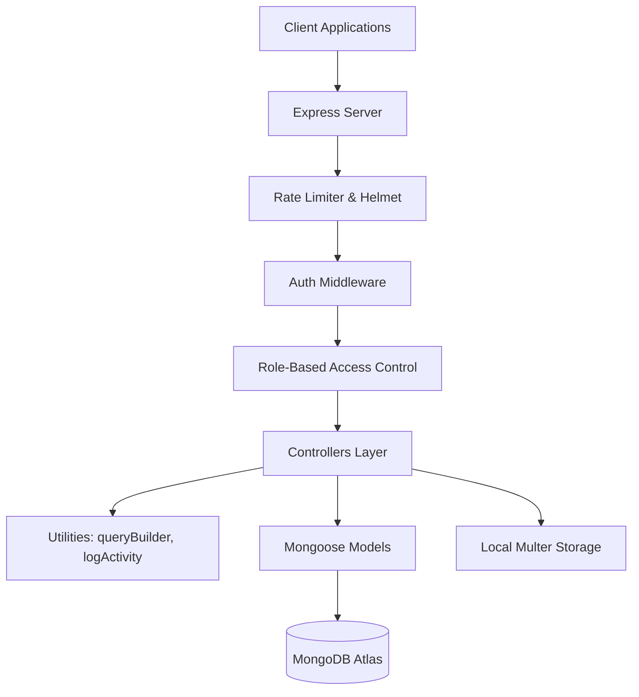

# 🚀 CMS Backend - Production-Ready Infrastructure

[](https://nodejs.org/)
[](https://www.mongodb.com/)
[](https://expressjs.com/)
[](https://opensource.org/licenses/MIT)

A Content Management System (CMS) backend architected for scalability, security, and deep data insights. This project serves as a comprehensive showcase of professional backend engineering, featuring advanced MongoDB aggregation pipelines, ACID transactions, and a robust security infrastructure.

---

## 📑 Table of Contents

- [Core Value Proposition](#-core-value-proposition)
- [Technical Architecture](#-technical-architecture)
- [Key Features](#-key-features)
- [Advanced MongoDB Implementations](#-advanced-mongodb-implementations)
- [API Reference](#-api-reference)
- [Database Schema](#-database-schema)
- [Getting Started](#-getting-started)
- [Security & Performance](#-security--performance)

---

## 💎 Core Value Proposition

This CMS is not just a CRUD application; it is a **hardened infrastructure** designed to handle real-world complexities:

- **Zero-Downtime Reliability**: Centralized error handling prevents unhandled rejections from crashing the process.
- **Data Integrity**: Multi-document operations are wrapped in ACID transactions to ensure consistency.
- **Deep Observability**: Every mutation is logged in a high-performance capped collection for auditing.
- **Scalable Search**: Leverages MongoDB's native text indexing for fast, relevant content discovery.

---

## 🏗 Technical Architecture



---

## 🌟 Key Features

### 🔐 Security & Identity

- **Robust Auth Flow**: Signup-then-Verify flow utilizing email OTPs with auto-expiring TTL indexes.
- **RBAC**: Granular permissions for `Users` and `Admins`. Admins have full system visibility and user management capabilities.
- **Identity Protection**: Automatic exclusion of sensitive fields (passwords, `__v`) from all JSON responses using Mongoose transforms.

### 📁 Content Management

- **Artifact CRUD**: Full lifecycle management for artifacts with status control (`draft`/`published`) and tag-based categorization.
- **File Uploads**: Optimized Multer configuration for image uploads, featuring automatic cleanup of physical files when records are updated or deleted.
- **Social Engagement**: Atomic like/unlike and nested comment system designed for high concurrency.

### 🔍 Advanced Data Discovery

- **Reusable Query Engine**: A sophisticated `queryBuilder` utility supporting:
  - Multi-field filtering (e.g., `status=published&tags[in]=tech`).
  - Range queries (e.g., `createdAt[gte]=2023-01-01`).
  - Paginated responses with total counts and page metadata.
- **Global Text Search**: Instant search across titles and descriptions using MongoDB `$text` scoring.

---

## 🍃 Advanced MongoDB Implementations

This project demonstrates senior-level proficiency in MongoDB through:

### 1. Complex Aggregation Pipelines

Implemented sophisticated analytics for real-time reporting:

- **Trend Analysis**: Grouping artifacts by date to visualize content growth.
- **User Engagement**: Multi-stage `$lookup` and `$unwind` to identify most active users based on interactions.
- **Distribution Maps**: Frequency analysis of tags to identify popular content topics.

### 2. ACID Transactions

Guaranteed atomicity during complex "Cascade Deletes":

- When a user is deleted, the system starts a **Mongoose Session**.
- It identifies and deletes all associated artifacts and their physical image files.
- It pulls the user's ID from all `likes` and `comments` across the database.
- It deletes the user record.
- **Result**: Either everything succeeds, or nothing changes.

### 3. Capped Collections for Auditing

- The `AuditLog` model uses a **Capped Collection** (Fixed size: 10MB).
- This provides "First-In-First-Out" automatic data rotation, ensuring logs never consume excessive disk space while maintaining high write throughput.

---

## 🚀 API Reference

### Authentication

| Method | Endpoint               | Description            | Access |
| :----- | :--------------------- | :--------------------- | :----- |
| POST   | `/api/auth/signup`     | Register new user      | Public |
| POST   | `/api/auth/send-otp`   | Send verification OTP  | Public |
| POST   | `/api/auth/verify-otp` | Verify email via OTP   | Public |
| POST   | `/api/auth/login`      | Authenticate & get JWT | Public |

### Artifacts

| Method | Endpoint                | Description                    | Access      |
| :----- | :---------------------- | :----------------------------- | :---------- |
| GET    | `/api/artifacts`        | List all (Paginated/Filtered)  | Private     |
| GET    | `/api/artifacts/me`     | List my artifacts              | Private     |
| GET    | `/api/artifacts/search` | Text search artifacts          | Private     |
| POST   | `/api/artifacts`        | Create new artifact (w/ Image) | Private     |
| PATCH  | `/api/artifacts/:id`    | Update artifact                | Owner/Admin |
| DELETE | `/api/artifacts/:id`    | Delete artifact (Clean files)  | Owner/Admin |

### Analytics (Admin Only)

| Method | Endpoint                          | Description                  |
| :----- | :-------------------------------- | :--------------------------- |
| GET    | `/api/analytics/overview`         | Total counts & system health |
| GET    | `/api/analytics/top-artifacts`    | Rank artifacts by engagement |
| GET    | `/api/analytics/tag-distribution` | Content topic breakdown      |

---

## 🛠 Getting Started

### Prerequisites

- Node.js 18.x or higher
- MongoDB (Local or Atlas Cluster)
- Gmail account (for OTP sending)

### Installation

1. Clone the repository:
   ```bash
   git clone https://github.com/ghushitkumarchutia/cms.git
   cd cms-backend
   ```
2. Install dependencies:
   ```bash
   npm install
   ```
3. Configure `.env`:
   ```env
   PORT=3000
   MONGO_URI=mongodb+srv://...
   JWT_SECRET=your_jwt_secret
   EMAIL_USER=your_email@gmail.com
   EMAIL_PASS=your_app_password
   ```
4. Run in development:
   ```bash
   npm run dev
   ```

---

## 🛡 Security & Performance

- **Rate Limiting**: 100 requests per 15 minutes per IP to prevent DoS.
- **Payload Limits**: 10MB limit on JSON payloads for stability.
- **Index Optimization**: Compound indexes on `(createdBy, createdAt)` and Text indexes on content.
- **Graceful Shutdown**: Listens for `SIGTERM` to close database connections cleanly before exiting.

---

_Developed with precision for high-stake backend environments._
